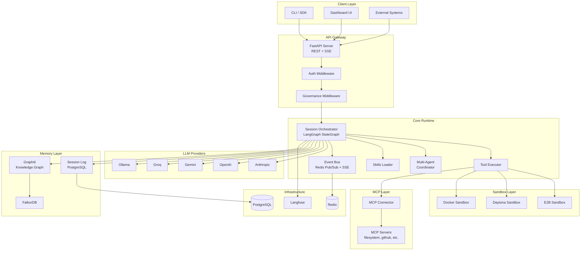
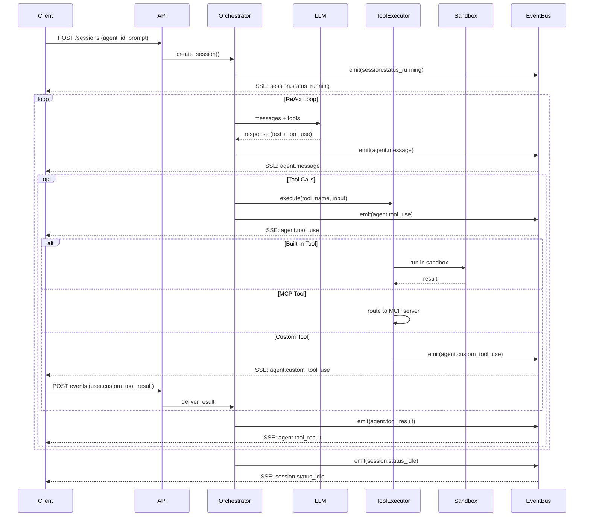
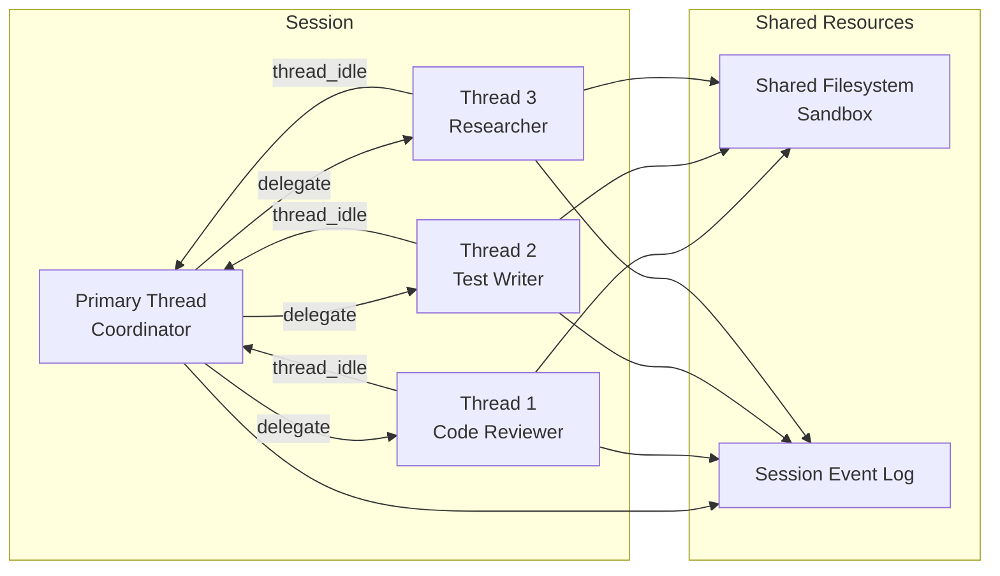
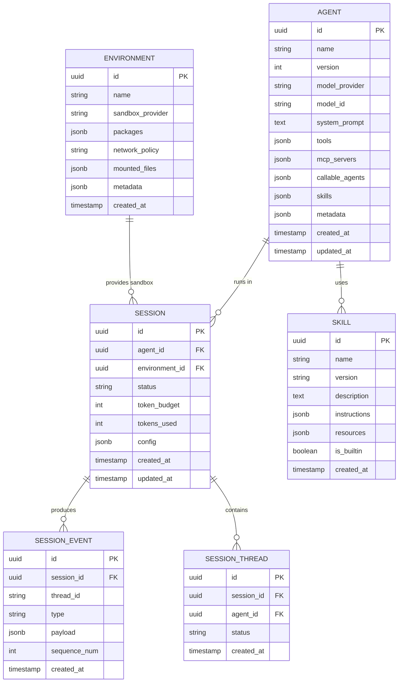
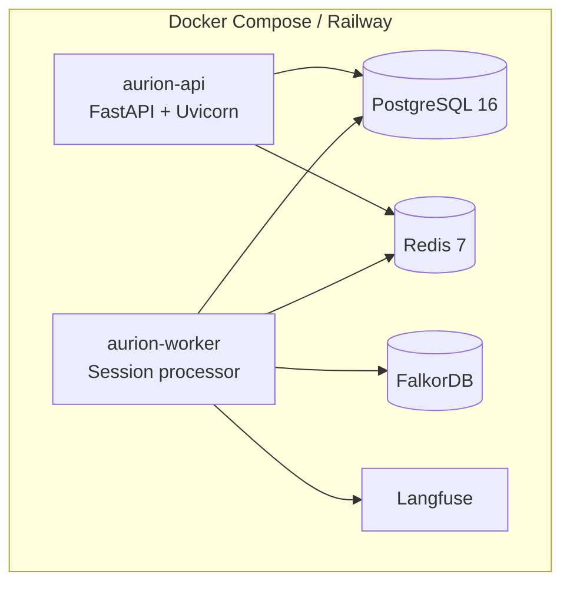

# Aurion Agent Runtime — Architecture Document

**Version**: 1.0.0  
**Date**: 2026-04-18  
**Status**: Production-grade implementation  

## 1. Overview

Aurion Agent Runtime is an open-source, self-hostable alternative to Claude Managed Agents that reproduces every feature of Anthropic's hosted agent service and adds capabilities Anthropic doesn't offer.

### Design Principles (from Anthropic's engineering blog)

1. **Brain/Hands/Session separation** — The harness (brain), sandbox (hands), and session log are decoupled interfaces. Each can fail or be replaced independently.
2. **Cattle, not pets** — Sessions are stateless harnesses. If one crashes, a new one reboots from the durable session log via `wake(session_id)`.
3. **`execute(name, input) → string`** — Universal tool interface. The harness doesn't know if it's talking to a container, MCP server, or custom tool.
4. **Session ≠ Context Window** — The session is an append-only event log that lives outside the LLM context. The harness selects slices via `getEvents()`.

### Advantages over Claude Managed Agents

| Feature | Claude Managed Agents | Aurion Agent Runtime |
|---|---|---|
| LLM Provider | Anthropic only | Anthropic, OpenAI, Gemini, Groq, Ollama |
| Session Duration | 24h max | Unlimited |
| Tool Execution | Sequential | Parallel + Sequential |
| Self-hosting | No | Docker, K8s, Railway, bare metal |
| Sandbox | Proprietary | E2B / Daytona / Docker (pluggable) |
| Agent Cloning | No | Yes, with version branching |
| Token Budget | No | Per-session configurable budget |
| Skills Sharing | No marketplace | Skills marketplace |
| Observability | Limited | Full Langfuse integration |
| Governance | None | Microsoft Agent Governance Toolkit |

## 2. System Architecture



## 3. Session Lifecycle



## 4. Multi-Agent Flow



## 5. Data Model



## 6. Component Interfaces

### 6.1 Tool Executor Interface

```python
class ToolExecutor(Protocol):
    async def execute(self, name: str, input: dict) -> str:
        """execute(name, input) → string — the universal tool interface"""
        ...

    async def list_tools(self) -> list[ToolDefinition]:
        """Return all available tool definitions"""
        ...
```

### 6.2 Sandbox Interface

```python
class SandboxProvider(Protocol):
    async def create(self, config: EnvironmentConfig) -> Sandbox:
        """Provision a new sandbox"""
        ...

class Sandbox(Protocol):
    async def execute(self, command: str, timeout: int = 30) -> ExecutionResult:
        """Run a command in the sandbox"""
        ...

    async def read_file(self, path: str) -> str: ...
    async def write_file(self, path: str, content: str) -> None: ...
    async def list_files(self, pattern: str) -> list[str]: ...
    async def close(self) -> None: ...
```

### 6.3 LLM Provider Interface

```python
class LLMProvider(Protocol):
    async def create_message(
        self,
        messages: list[Message],
        tools: list[ToolDefinition],
        system: str,
        max_tokens: int,
        stream: bool = True,
    ) -> AsyncIterator[MessageChunk]:
        ...
```

### 6.4 Memory Interface

```python
class MemoryProvider(Protocol):
    async def add(self, session_id: str, content: str, metadata: dict) -> None: ...
    async def search(self, query: str, group_id: str, limit: int = 10) -> list[Memory]: ...
    async def get_session_log(self, session_id: str, start: int = 0, end: int = -1) -> list[Event]: ...
```

## 7. Event Types

| Event Type | Direction | Description |
|---|---|---|
| `user.message` | Client → Agent | User sends a message |
| `user.tool_confirmation` | Client → Agent | Tool execution approval |
| `user.custom_tool_result` | Client → Agent | Custom tool execution result |
| `agent.message` | Agent → Client | Agent text response |
| `agent.tool_use` | Agent → Client | Agent invokes a tool |
| `agent.tool_result` | Agent → Client | Tool execution result |
| `agent.custom_tool_use` | Agent → Client | Agent requests custom tool execution |
| `session.status_running` | System | Session started processing |
| `session.status_idle` | System | Session finished, waiting |
| `session.error` | System | Session error |
| `session.thread_created` | System | New agent thread spawned |
| `session.thread_idle` | System | Agent thread finished |
| `agent.thread_message_sent` | System | Cross-thread message sent |
| `agent.thread_message_received` | System | Cross-thread message received |

## 8. API Endpoints

### Agents
- `POST /v1/agents` — Create agent
- `GET /v1/agents` — List agents
- `GET /v1/agents/:id` — Get agent
- `PATCH /v1/agents/:id` — Update agent
- `DELETE /v1/agents/:id` — Delete agent
- `POST /v1/agents/:id/clone` — Clone agent

### Environments
- `POST /v1/environments` — Create environment
- `GET /v1/environments` — List environments
- `GET /v1/environments/:id` — Get environment
- `DELETE /v1/environments/:id` — Delete environment

### Sessions
- `POST /v1/sessions` — Create and start session
- `GET /v1/sessions/:id` — Get session
- `GET /v1/sessions/:id/stream` — SSE event stream
- `POST /v1/sessions/:id/events` — Send events (user messages, tool results)
- `GET /v1/sessions/:id/events` — List session events
- `POST /v1/sessions/:id/interrupt` — Interrupt running session
- `DELETE /v1/sessions/:id` — Terminate session

### Session Threads (Multi-agent)
- `GET /v1/sessions/:id/threads` — List threads
- `GET /v1/sessions/:id/threads/:tid/stream` — Stream thread events
- `GET /v1/sessions/:id/threads/:tid/events` — List thread events

### Skills
- `POST /v1/skills` — Create skill
- `GET /v1/skills` — List skills
- `GET /v1/skills/:id` — Get skill
- `DELETE /v1/skills/:id` — Delete skill

### MCP
- `POST /v1/mcp/servers` — Register MCP server
- `GET /v1/mcp/servers` — List MCP servers
- `POST /v1/mcp/servers/:id/discover` — Discover tools

## 9. Deployment



## 10. Security Model

1. **Sandbox isolation** — All agent code runs in isolated sandboxes (E2B microVM / Daytona container / Docker)
2. **Credential vault** — No credentials in sandbox. MCP OAuth tokens stored in encrypted vault, accessed via proxy.
3. **Token budgets** — Per-session token limits prevent runaway agents
4. **Tool permissions** — `always_allow`, `always_ask`, `always_deny` per tool
5. **Network policies** — Configurable restricted/unrestricted per environment
6. **Governance** — Microsoft Agent Governance Toolkit integration for OWASP Agentic AI risks
